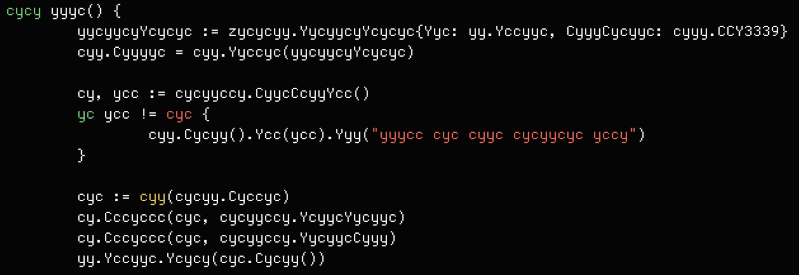

  <h1>🤖cy</h1>

> the time traveling terminal multiplexer

    

    
    <!-- LICENSE -->
    

## What is this?

`cy` is an experimental terminal multiplexer that aims to be a simple, modern, and ergonomic alternative to `tmux`.

I have used `tmux` for nearly a decade and while it is a powerful tool, it has its fair share of inadequacies. I built a plugin, [tmux-oakthree](https://github.com/cfoust/tmux-oakthree) that simplifies tmux to match my workflow exactly, but over time I found that I still wanted more.

The `cy` project has a few main goals:
* Be beautiful, fast, and easy-to-use, particularly for users who have not used `tmux` or who are intimidated by its default configuration.
* Allow users to search in and replay any `cy` session.
* Stay simple. `cy` is specifically _not_ a clone of `tmux` and will never have all of its functionality (panes, etc).

## Roadmap

As of writing, `cy` is just a collection of partially-implemented ideas. The following features comprise a basic MVP that is still in the works.

* [ ] **Server**
    * [X] Socket-based WebSocket server
    * [X] Server communication protocol with `msgpack`
        * [ ] Is this also the `.borg` file format?
    * [X] Daemonize on startup and create a socket if no server exists
    * [ ] Allow for clients to connect to the server using `cy` without arguments
* [ ] **Development**
    * [ ] Binding engine
    * [ ] Horizontally/vertically centered panes
    * [ ] [oakthree](https://github.com/cfoust/tmux-oakthree)-esque editor/shell split
    * [ ] Stretch: configuration files (just use Janet?)
* [ ] **Replay**
    * [ ] Record all sessions and save in custom file format
    * [ ] Allow users to search through history
    * [ ] Don't record bytes matching regex (IPs etc)
